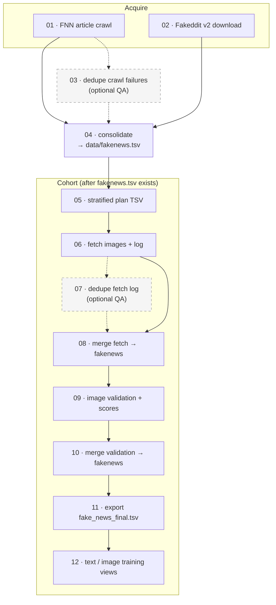

# Pipeline (`pipeline/`)

Numbered Python entrypoints for **FakeNewsNet + Fakeddit → unified table → stratified multimodal cohort → training exports**. Run from the **project root**:

```bash
python pipeline/04_consolidate_fakenews_tsv.py all
```

Paths in CLI args resolve from the project root unless absolute. Generated artefacts live under **`data/`** (mostly gitignored). Upstream Git clones live under **`pipeline/fakenewsnet/`** and **`pipeline/fakeddit/`** (nested repos, gitignored).

**Interactive EDA (optional):** [`notebooks/fakenews_preprocessing_eda.ipynb`](../notebooks/fakenews_preprocessing_eda.ipynb) — see [`reporting/README.md`](../reporting/README.md).

---

## Pipeline flow

Solid arrows are the default path. Dashed arrows are **optional QA** steps (run when duplicate log lines or noisy failure logs cause problems).



**Note:** `01` can invoke `04 … all` after a crawl unless you pass `--no-consolidate-image-refs`.

---

## What to run

| Goal | Steps |
|------|--------|
| **Unified working table** | `04` (`all` \| `fakeddit` \| `fakenewsnet`) — or restore a backed-up `data/fakenews.tsv` |
| **Raw corpora only** | `01` and/or `02` (then `04` when ready) |
| **FNN crawl hygiene** | `03` (optional) |
| **Thesis multimodal cohort → `fake_news_final.tsv`** | `05 → 06 → 08 → 09 → 10 → 11` (+ `07` if fetch log has duplicate `sample_id`s) |
| **Goal 2 single-modality baselines** | `12` after `11` → `fake_news_final_text.tsv` + `fake_news_final_image.tsv` |
| **Training scripts / Gradio demo** | Uses the step **12** outputs (see [`training/README.md`](../training/README.md)) |

**Supporting data file:** `pipeline/reddit_placeholder_sha256.txt` (SHA blocklist referenced by `06`, not executed).

---

## Scripts (01–12)

| # | Script | Stage |
|---|--------|--------|
| 01 | `01_acquire_fakenewsnet_crawl.py` | Acquire — crawl FNN articles → `data/processed/fakenewsnet/` |
| 02 | `02_acquire_fakeddit_metadata.py` | Acquire — Fakeddit v2 TSVs from Google Drive |
| 03 | `03_qa_fnn_dedupe_crawl_failures.py` | **Optional QA** — dedupe `crawl_failures.jsonl` |
| 04 | `04_consolidate_fakenews_tsv.py` | **Consolidate** — build `data/fakenews.tsv` |
| 05 | `05_cohort_build_plan.py` | Cohort — stratified plan TSV |
| 06 | `06_cohort_fetch_images.py` | Cohort — download images; append fetch log |
| 07 | `07_qa_cohort_dedupe_fetch_log.py` | **Optional QA** — dedupe `cohort_image_fetch.log` |
| 08 | `08_cohort_merge_fetch_log_into_fakenews.py` | Cohort — merge fetch columns into `fakenews.tsv` |
| 09 | `09_cohort_image_validation.py` | Cohort — heuristic image QC + 1–100 validity score |
| 10 | `10_cohort_merge_image_validation_into_fakenews.py` | Cohort — merge validation columns into `fakenews.tsv` |
| 11 | `11_cohort_export_final_tsv.py` | Cohort — export gated `fake_news_final.tsv` (default score ≥ 75) |
| 12 | `12_cohort_export_modality_views.py` | Cohort — split into text-only and image-only training TSVs |

Each script: `python pipeline/<script>.py --help` for flags.

---

## Reproducible cohort order

After `data/fakenews.tsv` exists:

```bash
python pipeline/05_cohort_build_plan.py
python -u pipeline/06_cohort_fetch_images.py --plan-tsv data/processed/cohorts/multimodal_plan_n50000_seed42.tsv

# Optional if the log has duplicate sample_id lines:
python pipeline/07_qa_cohort_dedupe_fetch_log.py

python pipeline/08_cohort_merge_fetch_log_into_fakenews.py
python pipeline/09_cohort_image_validation.py              # --resume as needed
python pipeline/10_cohort_merge_image_validation_into_fakenews.py
python pipeline/11_cohort_export_final_tsv.py
python pipeline/12_cohort_export_modality_views.py         # Goal 2 baselines
```

Close `data/fakenews.tsv` in the IDE before merge steps **08** and **10** on large files.

---

## Outputs map

| Path | Produced by |
|------|-------------|
| `data/fakenews.tsv` | `04` (initial); updated by `08`, `10` |
| `data/fake_news_final.tsv` | `11` — gated multimodal cohort |
| `data/fake_news_final_text.tsv` | `12` — all step-11 rows + text restored from provenance |
| `data/fake_news_final_image.tsv` | `12` — image-eligible subset with local paths |
| `data/processed/fakenewsnet/` | `01` — article JSON, `crawl_failures.jsonl`, etc. |
| `data/processed/fakeddit/v2_text_metadata/` | `02` — official multimodal / all-sample TSVs |
| `data/processed/cohorts/multimodal_plan_n*.tsv` | `05` (name varies with `--n` / `--seed`) |
| `data/processed/images/` + `cohort_image_fetch.log` | `06` |
| `data/processed/cohorts/image_validation/cohort_image_validation.tsv` | `09` |
| `data/processed/cohorts/image_validation/cohort_image_validation_summary.log` | `09` |

**Dependencies:** `requirements.txt` (general); `requirements-fakenewsnet-crawl.txt` (step `01`).

---

## Clone locations and acquire commands

Official repos are cloned under **`pipeline/`** as nested Git repos (ignored by the MSc project root).

### FakeNewsNet

- **Remote:** [github.com/KaiDMML/FakeNewsNet](https://github.com/KaiDMML/FakeNewsNet)
- **Local:** `pipeline/fakenewsnet/` — index CSVs in `dataset/`, crawlers in `code/`
- **Crawl output:** `data/processed/fakenewsnet/<politifact|gossipcop>/<fake|real>/<id>/news content.json`
- **Sidecars:** `crawl_failures.jsonl`, optional `_manifest.json`

```bash
pip install -r requirements-fakenewsnet-crawl.txt
python pipeline/01_acquire_fakenewsnet_crawl.py --out data/processed/fakenewsnet --resume
```

Use **`--resume`** to skip existing JSON; **`--retry-empty`** for files with no body text. Failed rows append to **`crawl_failures.jsonl`** (`no_article`, `empty_body`, `exception`). Default skips keys already in the failure log; use **`--retry-known-failures`** to retry. **`03`** dedupes that log.

**Speed:** default `--post-download-sleep 0.2` (faster than upstream 2 s). Optional `--workers 6` for parallel fetches (may increase 429/403).

Update clone: `git -C pipeline/fakenewsnet pull`

**Out of scope:** Twitter social graph (needs upstream `main.py` + API keys).

### Fakeddit

- **Remote:** [github.com/entitize/Fakeddit](https://github.com/entitize/Fakeddit)
- **Local:** `pipeline/fakeddit/` — README and helper scripts
- **Download:** `python pipeline/02_acquire_fakeddit_metadata.py` → **`data/processed/fakeddit/v2_text_metadata/`**

Typical subfolders: `multimodal_only_samples/` (`multimodal_train.tsv`, …) and `all_samples (also includes non multimodal)/`. Official split is encoded by **filename** (`train` / `validate` / `test`).

Update clone: `git -C pipeline/fakeddit pull`

**Not downloaded:** bulk image archive; comment TSVs.

---

## Unified table schema (`data/fakenews.tsv`)

One row per sample. Core columns (see [`04_consolidate_fakenews_tsv.py`](04_consolidate_fakenews_tsv.py)):

| Column | Meaning |
|--------|---------|
| `dataset` | `fakeddit` \| `fakenewsnet` |
| `sample_id` | Stable ID, e.g. `fd:{id}` / `fnn:{source}:{label}:{id}` |
| `split_official` | Fakeddit: from source file; FNN: empty |
| `label_binary` / `label_fine` | Project labels (Fakeddit `2_way` / `6_way`; FNN from path) |
| `text` / `title_raw` | Article text (may be sparse until step **12** restores from provenance for exports) |
| `image_ref` / `has_image_ref` | Primary image URL candidate (metadata-level; not proof of download) |
| `article_url` / `domain` | Source URL and domain/subreddit |
| `provenance` | Path to source TSV or JSON (audit trail) |

**Cohort enrichment** (added by steps **08** / **10**):

| Column group | Added by |
|--------------|----------|
| `cohort_image_fetch_status`, `cohort_image_local_path`, `cohort_image_fetch_detail`, `cohort_multimodal_image_ok` | `08` |
| `image_option1_validity_score`, `image_option1_qc_flags`, `image_option1_training_eligible` | `10` |

**Final exports:**

- **`fake_news_final.tsv`** — rows with `image_option1_validity_score` ≥ threshold (default 75)
- **`fake_news_final_text.tsv`** — same cohort, text columns restored from provenance
- **`fake_news_final_image.tsv`** — subset with fetch OK + training-eligible + local path

---

## Sources and limitations

| Corpus | Role | Limitations |
|--------|------|-------------|
| **FakeNewsNet** | News articles (PolitiFact + GossipCop); bodies via local crawl | Link rot, bot blocking, empty pages; ~23k index rows, crawl success varies |
| **Fakeddit** | Reddit multimodal benchmark (title + `image_url`); official splits in filenames | `image_url` is metadata until downloaded and validated |

**Citations:** FakeNewsNet — papers in `pipeline/fakenewsnet/README.md`; Fakeddit — Nakamura et al. (see `pipeline/fakeddit/README.md`).

**Evaluation note:** Fakeddit benchmark-style evaluation uses `split_official` and the public test file. Joint cross-dataset splits need a documented `split_study` rule and are not the same protocol unless reported separately.

---

## `data/` layout

```
data/
├── fakenews.tsv                 # working unified table
├── fake_news_final.tsv          # gated cohort (step 11)
├── fake_news_final_text.tsv     # text baseline (step 12)
├── fake_news_final_image.tsv    # image baseline (step 12)
└── processed/
    ├── fakenewsnet/             # FNN crawl tree + crawl_failures.jsonl
    ├── fakeddit/v2_text_metadata/
    ├── cohorts/                 # plan TSV, image_validation/
    └── images/                  # downloaded files + cohort_image_fetch.log
```

Large upstream clones and generated outputs stay **gitignored** in a fresh checkout.
