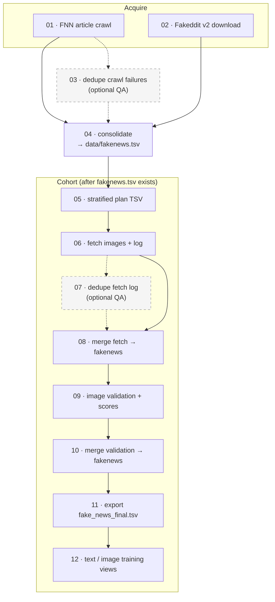

# Pipeline

This directory contains the **data-preparation stage** of the project. It
acquires the two source corpora (FakeNewsNet and Fakeddit), consolidates them
into a single unified table, fetches and validates the linked images, and
exports the gated cohort TSVs used for training.

**All steps run locally** as numbered Python scripts in `pipeline/src/`, executed
from the **project root**. Paths in command-line arguments resolve from the
project root unless they are absolute. Generated artefacts are written under
`data/` (mostly gitignored).

The model-training stage that consumes these outputs is described separately in
[`training/README.md`](../training/README.md). An optional, read-only
exploratory data analysis (EDA) notebook profiles the generated artefacts for
QA and reporting — see [Section 6](#6-exploratory-data-analysis-eda-notebook).

## Contents

- [What you need before you start](#1-what-you-need-before-you-start)
- [Pipeline flow](#2-pipeline-flow)
- [How to run the pipeline](#3-how-to-run-the-pipeline)
- [Scripts (01–12)](#4-scripts-0112)
- [Outputs](#5-outputs)
- [Exploratory data analysis (EDA) notebook](#6-exploratory-data-analysis-eda-notebook)
- [Unified table schema](#7-unified-table-schema)
- [Sources and limitations](#8-sources-and-limitations)

---

## 1. What you need before you start

| Requirement | Detail |
|-------------|--------|
| **Python environment** | A virtual environment built from `pipeline/requirements.txt`, which already includes the FakeNewsNet crawl dependencies used by step `01` (see [Step 3.1](#step-31--set-up-the-environment)). |
| **Upstream repositories** | FakeNewsNet and Fakeddit, cloned under `pipeline/sources/` as nested Git repos (gitignored). See [Step 3.2](#step-32--clone-the-upstream-repositories). |
| **Disk space** | Room for downloaded images and the upstream clones under `data/` and `pipeline/`. |

> Run every command from the **project root** (e.g. `python pipeline/src/04_consolidate_fakenews_tsv.py all`). The numbered scripts are entrypoints; the supporting file `pipeline/src/reddit_placeholder_sha256.txt` (a SHA blocklist referenced by step `06`) is not executed directly.

## 2. Pipeline flow

The diagram below shows the full process: **FakeNewsNet + Fakeddit → unified
table → stratified multimodal cohort → training exports**. Solid arrows are the
default path; dashed arrows are **optional QA** steps (run when duplicate log
lines or noisy failure logs cause problems).



## 3. How to run the pipeline

The pipeline has two phases: building the **unified working table** (steps
01–04), then building the **multimodal cohort and training exports** (steps
05–12).

> **Runtime:** steps `01` (FNN article crawl) and `06` (cohort image fetch) take the longest time to run — both are network-bound and can each run for **a few hours**
> (rates depend on your connection, link rot, and host throttling). Both support
> `--resume` / restart-friendly logs, so they can be stopped and continued. Every
> other step is a local transform that finishes in seconds to a few minutes.

### Step 3.1 — Set up the environment

From the project root:

```bash
cd path/to/msc-project-csc-40098
python3 -m venv .venv
source .venv/bin/activate        # Windows: .venv\Scripts\activate
pip install -r pipeline/requirements.txt
```

`pipeline/requirements.txt` already includes the extra dependencies the step `01`
crawl needs (newspaper3k, lxml, etc.), so no separate install is required.

### Step 3.2 — Clone the upstream repositories

Both source repos are cloned under `pipeline/sources/` as nested Git repos (ignored by
the project root).

| Corpus | Remote | Local path |
|--------|--------|------------|
| FakeNewsNet | [github.com/KaiDMML/FakeNewsNet](https://github.com/KaiDMML/FakeNewsNet) | `pipeline/sources/fakenewsnet/` — index CSVs in `dataset/`, crawlers in `code/` |
| Fakeddit | [github.com/entitize/Fakeddit](https://github.com/entitize/Fakeddit) | `pipeline/sources/fakeddit/` — README and helper scripts |

Update the clones at any time with `git -C pipeline/sources/fakenewsnet pull` and
`git -C pipeline/sources/fakeddit pull`.

### Step 3.3 — Acquire the raw corpora (steps 01–02)

**FakeNewsNet** — crawl article bodies and image-URL candidates:

```bash
python pipeline/src/01_acquire_fakenewsnet_crawl.py --resume
```

- Output: `data/processed/fakenewsnet/<politifact|gossipcop>/<fake|real>/<id>/news content.json`, plus sidecars `crawl_failures.jsonl` and an optional `_manifest.json`.
- Use `--resume` to skip existing JSON and `--retry-empty` for files with no body text. Failed rows append to `crawl_failures.jsonl` (`no_article`, `empty_body`, `exception`); the default run skips keys already in that log, and `--retry-known-failures` retries them. Step `03` dedupes the log.
- **Speed:** the default `--post-download-sleep 0.2` is faster than upstream's 2 s, and fetches run with `--workers 6` by default (lower to 1–4 if a host returns 429/403). After a failed live fetch the crawler falls back to the Internet Archive (Wayback) by default; pass `--no-wayback` to skip it — faster on dead links, at the cost of a few recoveries.
- **Out of scope:** the Twitter social graph (needs upstream `main.py` plus API keys).

**Fakeddit** — download the v2 text/metadata TSVs:

```bash
python pipeline/src/02_acquire_fakeddit_metadata.py
```

- Output: `data/processed/fakeddit/v2_text_metadata/`, with subfolders such as `multimodal_only_samples/` and `all_samples (also includes non multimodal)/`. The official split (`train` / `validate` / `test`) is encoded in each filename.
- **Not downloaded:** the bulk image archive and the comment TSVs.

### Step 3.4 — Consolidate into the unified table (step 04)

```bash
python pipeline/src/04_consolidate_fakenews_tsv.py all   # or: fakeddit | fakenewsnet
```

This builds `data/fakenews.tsv`. Step `03` (dedupe `crawl_failures.jsonl`) is an
optional QA step you can run beforehand if the crawl log has duplicate lines.

### Step 3.5 — Build the multimodal cohort and exports (steps 05–12)

After `data/fakenews.tsv` exists:

```bash
python pipeline/src/05_cohort_build_plan.py
python -u pipeline/src/06_cohort_fetch_images.py --plan-tsv data/processed/cohorts/multimodal_plan_n50000_seed42.tsv

# Optional if the fetch log has duplicate sample_id lines:
python pipeline/src/07_qa_cohort_dedupe_fetch_log.py

python pipeline/src/08_cohort_merge_fetch_log_into_fakenews.py
python pipeline/src/09_cohort_image_validation.py              # --resume as needed
python pipeline/src/10_cohort_merge_image_validation_into_fakenews.py
python pipeline/src/11_cohort_export_final_tsv.py
python pipeline/src/12_cohort_export_modality_views.py         # training exports
```

> Step `06` stops automatically once it has fetched the **cohort size** — the
> number of `plan_role=primary` rows in the plan (50,000 for the default plan).
> The extra reserve rows exist to cover download failures, so a normal run fills
> the cohort and stops rather than fetching all 200,000 plan rows. Pass
> `--stop-after-ok 0` to fetch the entire plan, or `--stop-after-ok N` for a
> different target. It is single-threaded with a 45 s per-URL timeout (≈ a few
> hours for a full cohort); use `--limit N` for a quick test.

> Close `data/fakenews.tsv` in your IDE before running the merge steps `08` and `10` on large files.

### Quick reference — what to run for each goal

| Goal | Steps |
|------|-------|
| **Unified working table** | `04` (`all` \| `fakeddit` \| `fakenewsnet`) — or restore a backed-up `data/fakenews.tsv` |
| **Raw corpora only** | `01` and/or `02` (then `04` when ready) |
| **FNN crawl hygiene** | `03` (optional) |
| **Multimodal cohort → `fake_news_final.tsv`** | `05 → 06 → 08 → 09 → 10 → 11` (+ `07` if the fetch log has duplicate `sample_id`s) |
| **Single-modality training exports** | `12` after `11` → `fake_news_final_text.tsv` + `fake_news_final_image.tsv` |
| **Training / demo UI** | Uses the step `12` outputs (see [`training/README.md`](../training/README.md)) |

## 4. Scripts (01–12)

The entrypoint scripts and the `reddit_placeholder_sha256.txt` blocklist (a SHA
list referenced by step `06`) live in `pipeline/src/` and run from the project
root. The vendored upstream repositories (`pipeline/sources/fakenewsnet/`,
`pipeline/sources/fakeddit/`) stay under `pipeline/sources/`.

| # | Script | Stage |
|---|--------|-------|
| 01 | `01_acquire_fakenewsnet_crawl.py` | Acquire — crawl FNN articles → `data/processed/fakenewsnet/` |
| 02 | `02_acquire_fakeddit_metadata.py` | Acquire — Fakeddit v2 TSVs from Google Drive |
| 03 | `03_qa_fnn_dedupe_crawl_failures.py` | **Optional QA** — dedupe `crawl_failures.jsonl` |
| 04 | `04_consolidate_fakenews_tsv.py` | **Consolidate** — build `data/fakenews.tsv` |
| 05 | `05_cohort_build_plan.py` | Cohort — stratified plan TSV |
| 06 | `06_cohort_fetch_images.py` | Cohort — download images; append fetch log |
| 07 | `07_qa_cohort_dedupe_fetch_log.py` | **Optional QA** — dedupe `cohort_image_fetch.log` |
| 08 | `08_cohort_merge_fetch_log_into_fakenews.py` | Cohort — merge fetch columns into `fakenews.tsv` |
| 09 | `09_cohort_image_validation.py` | Cohort — heuristic image QC + 1–100 validity score |
| 10 | `10_cohort_merge_image_validation_into_fakenews.py` | Cohort — merge validation columns into `fakenews.tsv` |
| 11 | `11_cohort_export_final_tsv.py` | Cohort — export gated `fake_news_final.tsv` (default score ≥ 75) |
| 12 | `12_cohort_export_modality_views.py` | Cohort — split into text-only and image-only training TSVs |

Run `python pipeline/src/<script>.py --help` for the full set of flags on any script.

## 5. Outputs

| Path | Produced by |
|------|-------------|
| `data/fakenews.tsv` | `04` (initial); updated by `08`, `10` |
| `data/fake_news_final.tsv` | `11` — gated multimodal cohort |
| `data/fake_news_final_text.tsv` | `12` — all step-11 rows + text restored from provenance |
| `data/fake_news_final_image.tsv` | `12` — image-eligible subset with local paths |
| `data/processed/fakenewsnet/` | `01` — article JSON, `crawl_failures.jsonl`, etc. |
| `data/processed/fakeddit/v2_text_metadata/` | `02` — official multimodal / all-sample TSVs |
| `data/processed/cohorts/multimodal_plan_n*.tsv` | `05` (name varies with `--n` / `--seed`) |
| `data/processed/images/` + `cohort_image_fetch.log` | `06` |
| `data/processed/cohorts/image_validation/cohort_image_validation.tsv` | `09` |
| `data/processed/cohorts/image_validation/cohort_image_validation_summary.log` | `09` |

**`data/` layout:**

```
data/
├── fakenews.tsv                 # working unified table
├── fake_news_final.tsv          # gated cohort (step 11)
├── fake_news_final_text.tsv     # text export (step 12)
├── fake_news_final_image.tsv    # image export (step 12)
└── processed/
    ├── fakenewsnet/             # FNN crawl tree + crawl_failures.jsonl
    ├── fakeddit/v2_text_metadata/
    ├── cohorts/                 # plan TSV, image_validation/
    └── images/                  # downloaded files + cohort_image_fetch.log
```

Large upstream clones and generated outputs stay **gitignored** in a fresh
checkout, so `data/` starts empty.

## 6. Exploratory data analysis (EDA) notebook

[`notebooks/fakenews_preprocessing_eda.ipynb`](notebooks/fakenews_preprocessing_eda.ipynb)
is an **optional, read-only** companion to the pipeline. It profiles the
generated artefacts to surface data-quality issues *before* training and doubles
as a reproducible, documented record of the dataset's properties for the
write-up. It does not modify any pipeline output.

It is organised into sections that mirror the pipeline:

| Section | Profiles | Checks |
|---------|----------|--------|
| 1 | Unified `data/fakenews.tsv` | Row/column counts, nulls/blanks, duplicate `sample_id`, label balance, image-ref coverage by dataset |
| 2–3 | Fakeddit metadata + FNN crawl | Bad/missing `image_url`, `hasImage`, crawl success vs. index counts |
| 4 | Crawl-failure reconciliation | FNN rows in `fakenews.tsv` vs. succeeded JSON |
| 5 | Image fetch log | `cohort_image_fetch.log` status breakdown, failures by dataset |
| 6 | Gated export `data/fake_news_final.tsv` | Validity-score distribution, final label/dataset balance |

**Running it.** Run it from the project root **in the same environment as the
pipeline** (`pipeline/requirements.txt`). It needs the artefacts to exist first
(at minimum `data/fakenews.tsv`; section 6 also needs `data/fake_news_final.tsv`).

```bash
jupyter lab pipeline/notebooks/fakenews_preprocessing_eda.ipynb
# or run headless:
jupyter nbconvert --to notebook --execute --inplace \
  pipeline/notebooks/fakenews_preprocessing_eda.ipynb
```

> **Environment note.** Select the **project venv** as the Jupyter kernel. The
> plots use `seaborn >= 0.13` (the `legend=` argument); an older system/Anaconda
> seaborn will raise `Rectangle.set() got an unexpected keyword argument 'legend'`.

## 7. Unified table schema

`data/fakenews.tsv` has one row per sample. It is a lightweight index table — the
nine core columns below (see
[`04_consolidate_fakenews_tsv.py`](src/04_consolidate_fakenews_tsv.py)):

| Column | Meaning |
|--------|---------|
| `dataset` | `fakeddit` \| `fakenewsnet` |
| `sample_id` | Stable ID, e.g. `fd:{id}` / `fnn:{source}:{label}:{id}` |
| `split_official` | Fakeddit: from source file; FNN: empty |
| `domain` | Domain (FNN) / subreddit (Fakeddit) |
| `label_binary` / `label_fine` | Project labels (Fakeddit `2_way` / `6_way`; FNN from path) |
| `image_ref` / `has_image_ref` | Primary image-URL candidate (metadata-level; not proof of download) |
| `provenance` | Path to the source TSV or JSON (audit trail) |

Article **text**, **title**, and **article URL** are deliberately *not* stored
here — step `12` reconstructs them from each row's `provenance` file when building
the text export, which keeps `fakenews.tsv` compact.

**Cohort enrichment** (added by steps `08` / `10`):

| Column group | Added by |
|--------------|----------|
| `cohort_image_fetch_status`, `cohort_image_local_path`, `cohort_image_fetch_detail`, `cohort_multimodal_image_ok` | `08` |
| `image_option1_validity_score`, `image_option1_qc_flags`, `image_option1_training_eligible` | `10` |

**Final exports:**

- **`fake_news_final.tsv`** — rows with `image_option1_validity_score` ≥ threshold (default 75).
- **`fake_news_final_text.tsv`** — the same cohort, with text columns restored from provenance.
- **`fake_news_final_image.tsv`** — the subset with fetch OK + training-eligible + a local path.

## 8. Sources and limitations

| Corpus | Role | Limitations |
|--------|------|-------------|
| **FakeNewsNet** | News articles (PolitiFact + GossipCop); bodies via local crawl | Link rot, bot blocking, empty pages; ~23k index rows, crawl success varies |
| **Fakeddit** | Reddit multimodal benchmark (title + `image_url`); official splits in filenames | `image_url` is metadata until downloaded and validated |

**Citations:** FakeNewsNet — papers in `pipeline/sources/fakenewsnet/README.md`; Fakeddit
— Nakamura et al. (see `pipeline/sources/fakeddit/README.md`).

**Evaluation note:** Fakeddit benchmark-style evaluation uses `split_official`
and the public test file. Joint cross-dataset splits need a documented
`split_study` rule and are not the same protocol unless reported separately.
